# TeamUp
With this app users can create a profile and then find and create sports events in their local area. The user just needs to decide where (either from address or by dropping a pin on the map) and when the event should take place, plus how many people they need to join. Users can see each others profiles and rate each other, as well as comment on events, all improving the community feel of the TeamUp experience.

See Below for screenshots:

**Homepage**
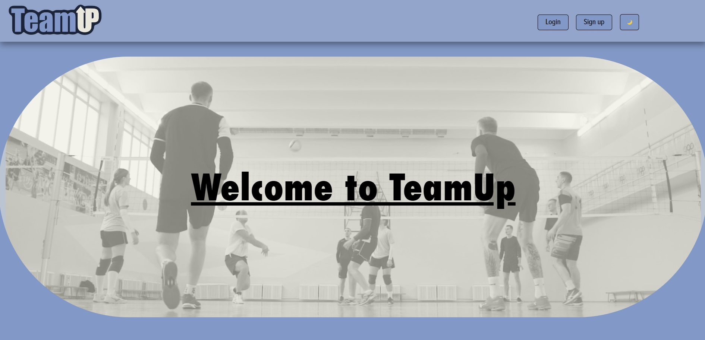

**Homepage (About TeamUp)**
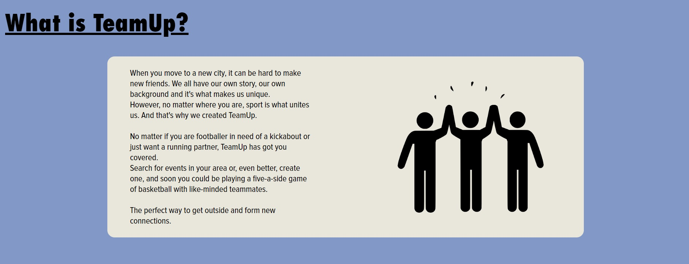

**Homepage (Registration Form)**
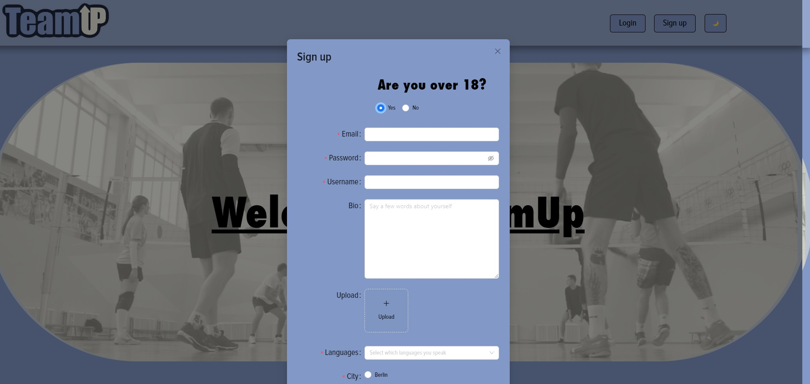

**Personal Dashboard**
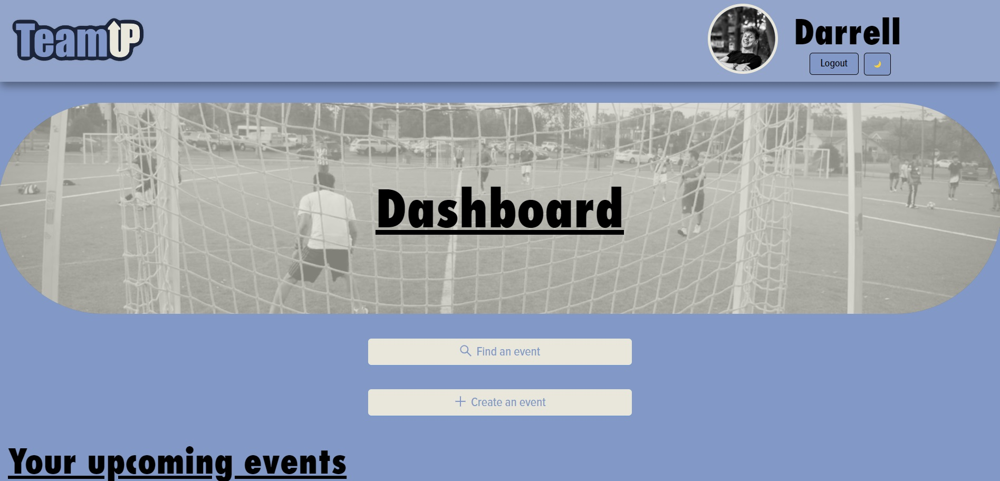

**Personal Dashboard (Upcoming and liked events)**
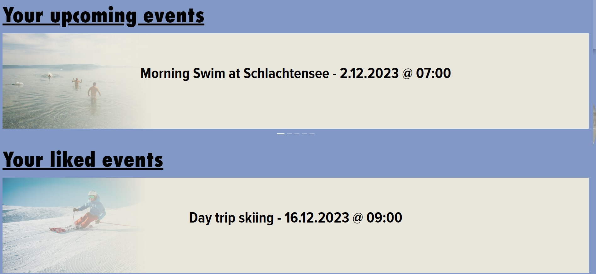

**Find Event**
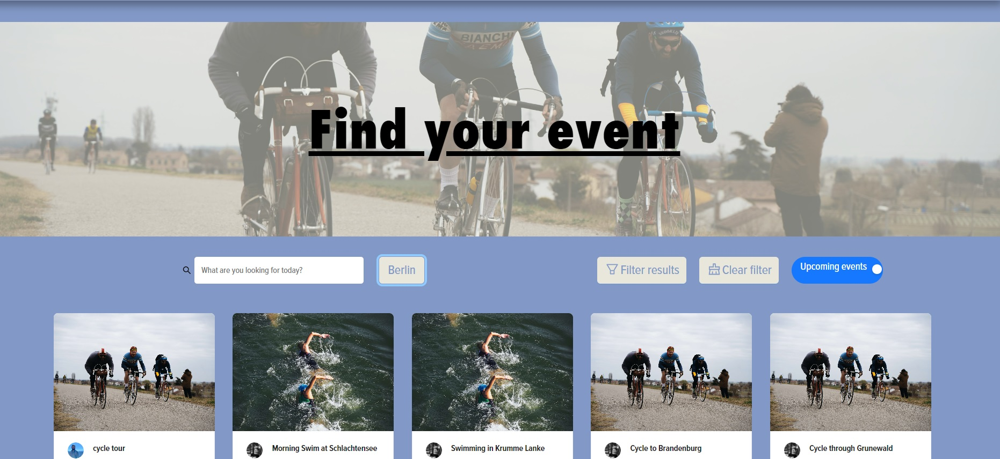

**Event Information (Title, sport type, date and time)**
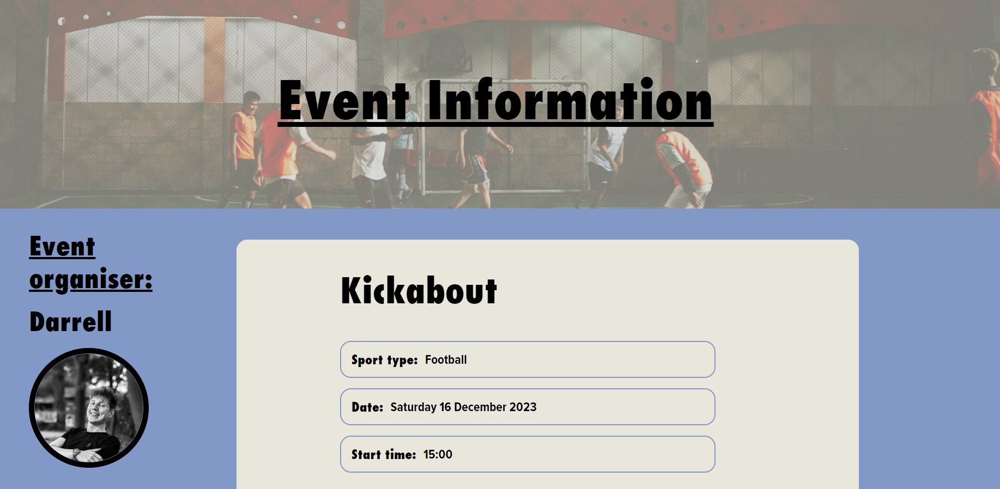

**Event Information (Map, description, capacity)**
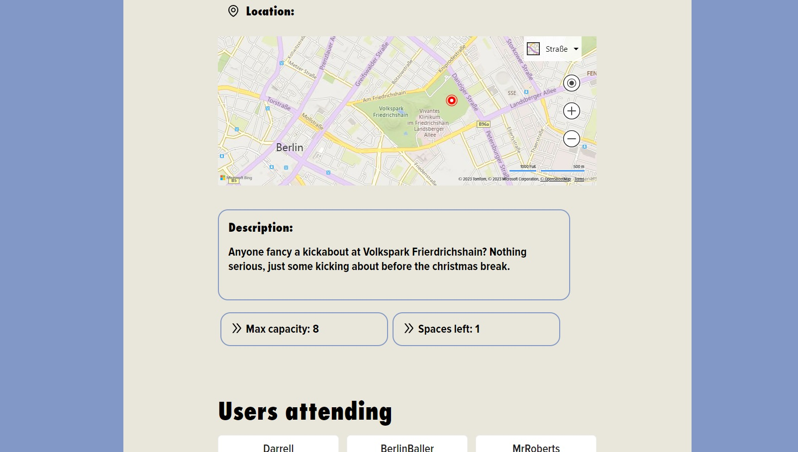

**Event Information (Users attending)**
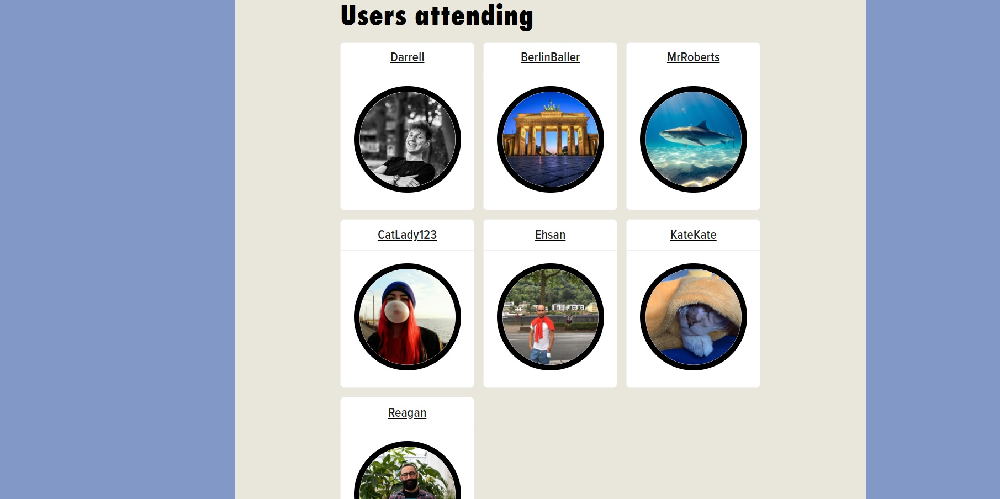

**Event Information (Comment section)**
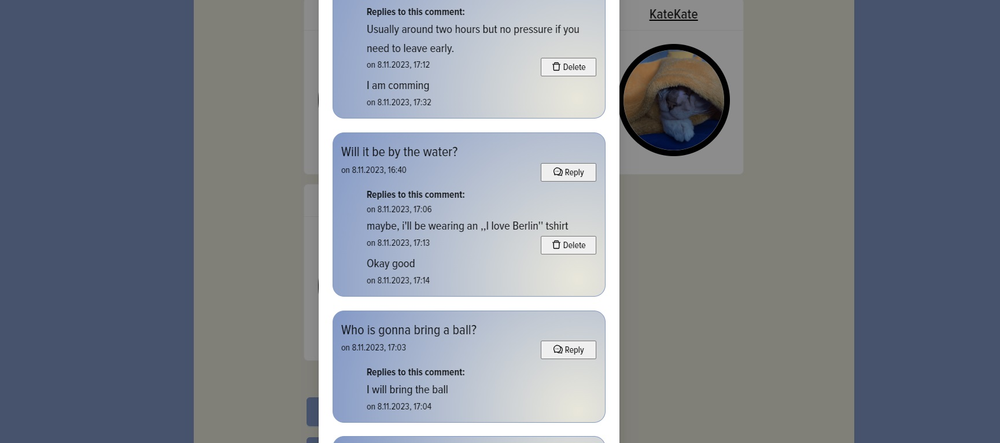

**Create Event (Select location)**
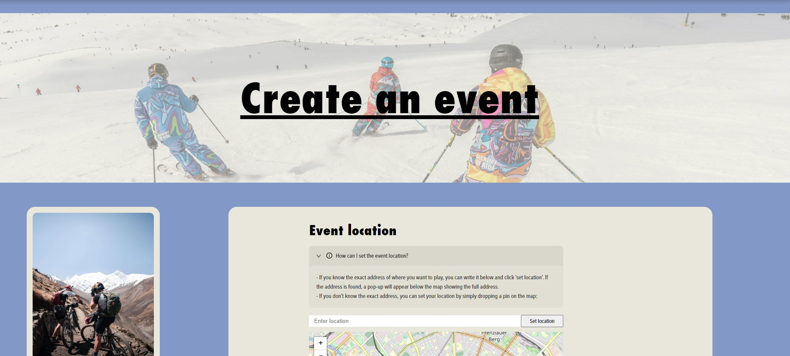

**Create Event Form**
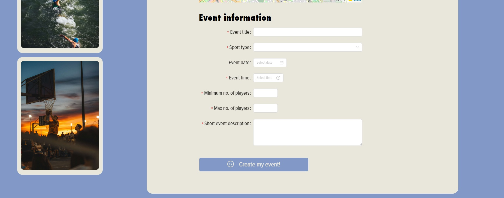

**Profile Page (Username, profile picture and date joined)**
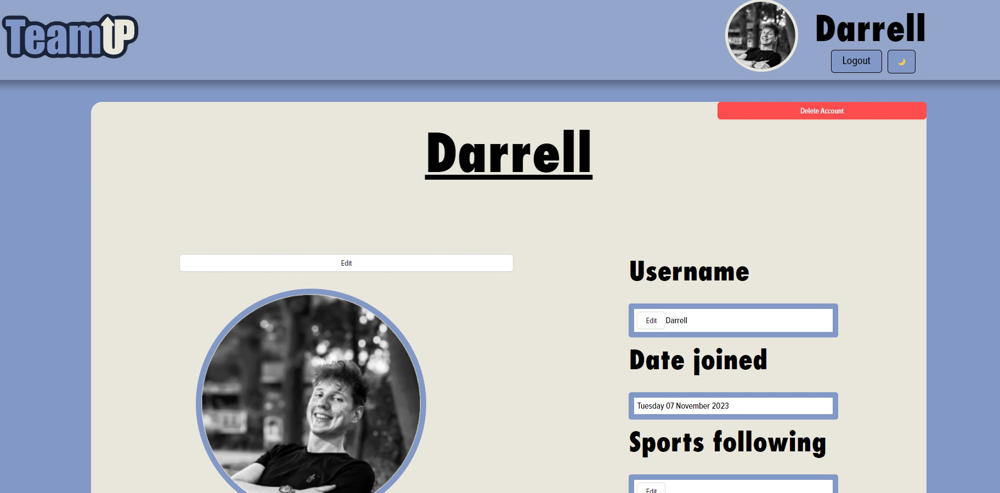

**Profile Page (Rating, badges, events joined and more)**
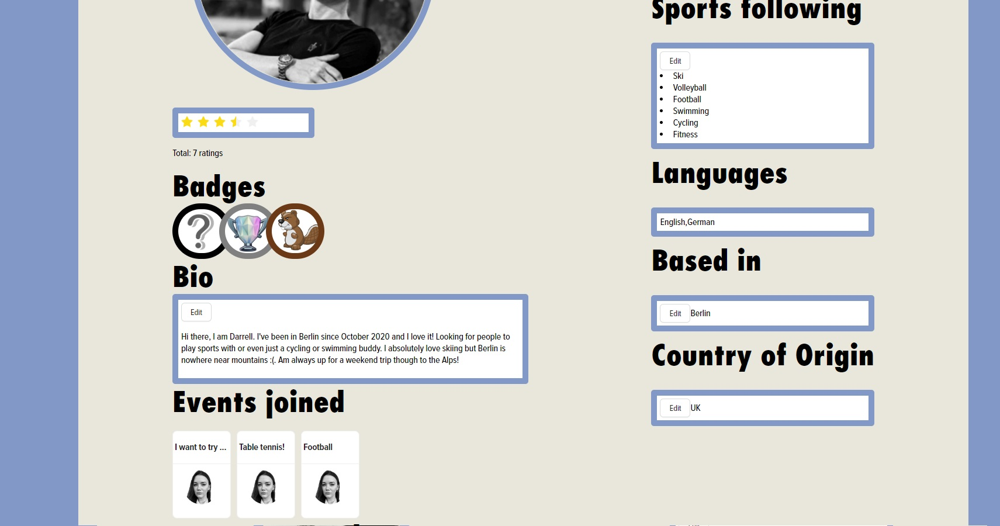